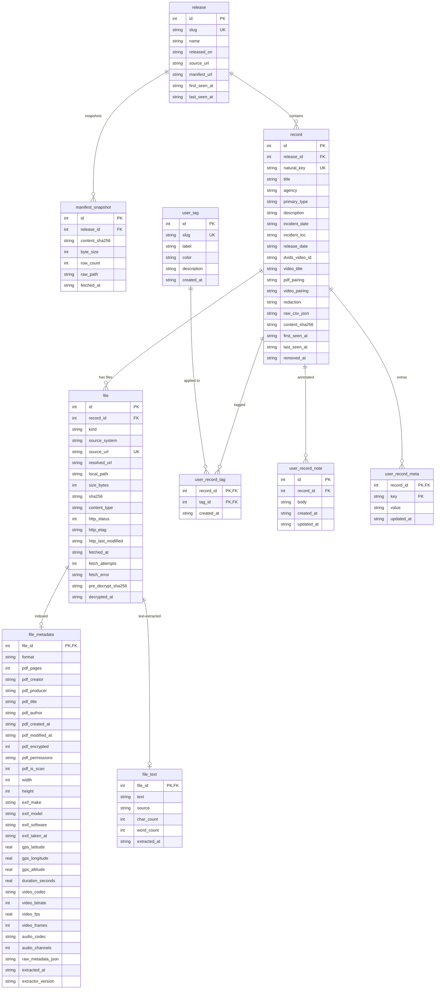

# Disclosure — Schema

Status: implemented and indexed against Release 01 (2026-05-09).
Last updated: 2026-05-09.

This document describes:
- The on-disk filesystem layout for downloaded files.
- The SQLite database schema (gov mirror + indexer output + audit + user annotations).
- The change-detection algorithm so re-runs are cheap.
- Where future sources (DVIDS videos already live; National Archives, etc.) plug in.

If you change schema, bump the migration version and update this doc.

**Apps that touch the DB:**
- `apps/downloader` writes: `release`, `record`, `file` (download fields), `manifest_snapshot`, `fetch_run`.
- `apps/indexer` writes: `file_metadata`, `file_text`, and a few decrypt-tracking columns on `file`.
- Neither writes any `user_*` table.

## Filesystem layout

```
disclosure/
├── data/                                    (gitignored)
│   ├── disclosure.db                        SQLite — all metadata, gov + user
│   ├── manifests/
│   │   └── release_1/
│   │       └── 2026-05-08T22-43-12Z.csv     raw CSV snapshots, kept forever
│   ├── files/
│   │   └── release_1/
│   │       ├── pdfs/        65_hs1-834228961_62-hq-83894_section_10.pdf
│   │       ├── images/      <full-size IMG records>
│   │       ├── thumbnails/  <one .jpg per record with a thumbnail>
│   │       └── videos/      <future: DVIDS mp4>
│   └── logs/
│       └── 2026-05-08.log
└── ...
```

Filenames preserved as-is from war.gov. We never rename files we mirror.

## Source of truth

Release 01 manifest: `https://www.war.gov/Portals/1/Interactive/2026/UFO/uap-csv.csv`
(fetched via real Chrome — Akamai 403s every other client).

CSV columns we use:
| # | Column | Notes |
|---|---|---|
| 0 | Redaction | Currently empty — reserved |
| 1 | Release Date | Per-row (gov's release date for that record) |
| 2 | Title | Record title; in 3 cases multiple rows share one title (gov dupes) |
| 3 | Type | `PDF` / `IMG` / `VID`. Dirty: also seen as `'PDF '` (trailing space) |
| 4 | Video Pairing | Cross-ref to a related video record (e.g. `DoW-UAP-PR19`) |
| 5 | PDF Pairing | Cross-ref to a related PDF record (e.g. `DoW-UAP-D10`) |
| 6 | Description Blurb | Multi-paragraph; commas/newlines galore |
| 7 | DVIDS Video ID | Numeric ID for VID rows (separate hosting) |
| 8 | Video Title | |
| 9 | Agency | `FBI`, `NASA`, `Department of War`, `Department of State` |
| 10 | Incident Date | Free text |
| 11 | Incident Location | Free text |
| 12 | PDF \| Image Link | The main file URL (war.gov/medialink/...) |
| 13 | Modal Image | Thumbnail URL (war.gov/medialink/.../thumbnail/...) |

Release 01 has 161 rows = 161 records (after the 3 exact duplicates collapse).
Type histogram (post-normalize): 119 PDF, 14 IMG, 28 VID.

## Database schema

Three layers:

1. **Gov** — mirrored from war.gov; downloader rewrites freely on each run.
2. **Audit** — run history; append-only.
3. **User** — your annotations. The downloader code is scoped to never write here.

### Migrations

Schema versioning lives in a `_migration` table. Migrations are SQL files in
`apps/downloader/src/db/migrations/NNN_*.sql`, applied in order on startup.

```sql
CREATE TABLE _migration (
  version    INTEGER PRIMARY KEY,
  name       TEXT NOT NULL,
  applied_at TEXT NOT NULL
);
```

### Layer 1 — Gov

```sql
CREATE TABLE release (
  id            INTEGER PRIMARY KEY,
  slug          TEXT NOT NULL UNIQUE,        -- 'release_1'
  name          TEXT NOT NULL,               -- 'Release 01'
  released_on   TEXT,                        -- '2026-05-08'
  source_url    TEXT NOT NULL,               -- 'https://www.war.gov/UFO/'
  manifest_url  TEXT NOT NULL,               -- '.../uap-csv.csv'
  first_seen_at TEXT NOT NULL,
  last_seen_at  TEXT NOT NULL
);

CREATE TABLE record (
  id              INTEGER PRIMARY KEY,
  release_id      INTEGER NOT NULL REFERENCES release(id),
  natural_key     TEXT NOT NULL UNIQUE,      -- derived; see "natural_key" below
  title           TEXT,
  agency          TEXT,
  primary_type    TEXT,                      -- 'PDF' | 'IMG' | 'VID' (normalized)
  description     TEXT,
  incident_date   TEXT,
  incident_loc    TEXT,
  release_date    TEXT,
  dvids_video_id  TEXT,
  video_title     TEXT,
  pdf_pairing     TEXT,                      -- cross-ref id to a paired PDF record
  video_pairing   TEXT,                      -- cross-ref id to a paired video record
  redaction       TEXT,                      -- currently empty in CSV
  raw_csv_json    TEXT NOT NULL,             -- the original CSV row(s) as JSON
  content_sha256  TEXT NOT NULL,             -- hash of salient fields, for change detection
  first_seen_at   TEXT NOT NULL,
  last_seen_at    TEXT NOT NULL,
  removed_at      TEXT                       -- non-null = no longer in current manifest
);

CREATE TABLE file (
  id                 INTEGER PRIMARY KEY,
  record_id          INTEGER NOT NULL REFERENCES record(id),
  kind               TEXT NOT NULL,          -- 'pdf' | 'image' | 'thumbnail' | 'video'
  source_system      TEXT NOT NULL,          -- 'war.gov' | 'dvids'
  source_url         TEXT NOT NULL UNIQUE,   -- canonical reference (stable identifier)
  resolved_url       TEXT,                   -- actual byte-stream URL when it differs (DVIDS mp4 on CloudFront)
  local_path         TEXT,                   -- relative to /data; NULL = not yet downloaded
  size_bytes         INTEGER,
  sha256             TEXT,                   -- of the bytes currently on disk (post-decrypt if applicable)
  content_type       TEXT,
  http_status        INTEGER,
  http_etag          TEXT,
  http_last_modified TEXT,
  fetched_at         TEXT,
  fetch_attempts     INTEGER NOT NULL DEFAULT 0,
  fetch_error        TEXT,
  -- Indexer-managed (only present on PDFs that the indexer decrypted):
  pre_decrypt_sha256 TEXT,                   -- the hash of the gov-original bytes
  decrypted_at       TEXT,                   -- ISO timestamp when qpdf stripped restrictions
  UNIQUE (record_id, kind, source_url)
);
```

#### natural_key derivation

Stable per record, recomputed identically on every run:

1. If row has a `PDF | Image Link` URL → use the URL's filename without extension, lowercased.
   (e.g. `65_hs1-834228961_62-hq-83894_section_10`)
2. Else if row is VID with a `DVIDS Video ID` → `dvids:{id}` (e.g. `dvids:1006119`).
3. Else → `title:{sha256(release_slug + "::" + trimmed_title).slice(0,16)}` (last-resort fallback).

#### content_sha256 derivation

`sha256(JSON.stringify({ title, primary_type, agency, description, incident_date, incident_loc, release_date, pdf_pairing, video_pairing, dvids_video_id, video_title, file_urls: [...] }))`

If this changes between runs, the gov has edited the record (e.g. new redaction layer
on a PDF, or a corrected description). We update the row and bump `last_seen_at`.

### Layer 1b — Indexer output (gov files, analyzed)

Populated by `apps/indexer`. One row per file in `file_metadata`; one row per
file with extracted text in `file_text`. The downloader does not write here.

```sql
CREATE TABLE file_metadata (
  file_id           INTEGER PRIMARY KEY REFERENCES file(id),
  format            TEXT,                  -- 'application/pdf', 'image/png', 'video/mp4', ...
  -- PDF-specific
  pdf_pages         INTEGER,
  pdf_creator       TEXT,                  -- the editor (e.g. 'Adobe Photoshop 25.6 (Windows)')
  pdf_producer      TEXT,                  -- the PDF generator (e.g. 'macOS Quartz PDFContext')
  pdf_title         TEXT,
  pdf_author        TEXT,
  pdf_created_at    TEXT,                  -- from PDF Info dict (often != gov release date!)
  pdf_modified_at   TEXT,
  pdf_encrypted     INTEGER,               -- 0/1; reflects state at extraction time
  pdf_permissions   TEXT,                  -- e.g. 'print:yes copy:no change:no addNotes:yes algorithm:AES-256'
  pdf_is_scan       INTEGER,               -- 0/1; heuristic on text-layer chars/page
  -- Image / video shared
  width             INTEGER,
  height            INTEGER,
  exif_make         TEXT,
  exif_model        TEXT,
  exif_software     TEXT,                  -- e.g. 'Adobe Illustrator 30.1 (Windows)'
  exif_taken_at     TEXT,
  gps_latitude      REAL,
  gps_longitude     REAL,
  gps_altitude      REAL,
  -- Video-specific
  duration_seconds  REAL,
  video_codec       TEXT,
  video_bitrate     INTEGER,
  video_fps         REAL,
  video_frames      INTEGER,
  audio_codec       TEXT,
  audio_channels    INTEGER,
  -- Catch-all (the full exiftool/pdfinfo JSON for forward-compat)
  raw_metadata_json TEXT,
  extracted_at      TEXT NOT NULL,
  extractor_version TEXT
);

CREATE INDEX idx_file_metadata_format    ON file_metadata(format);
CREATE INDEX idx_file_metadata_gps       ON file_metadata(gps_latitude, gps_longitude);
CREATE INDEX idx_file_metadata_exif_make ON file_metadata(exif_make);
CREATE INDEX idx_file_metadata_creator   ON file_metadata(pdf_creator);

CREATE TABLE file_text (
  file_id      INTEGER PRIMARY KEY REFERENCES file(id),
  text         TEXT NOT NULL,
  source       TEXT NOT NULL,              -- 'pdf-text-layer' | 'tesseract-ocr'
  char_count   INTEGER,
  word_count   INTEGER,
  extracted_at TEXT NOT NULL
);

-- FTS5 virtual table (external content; triggers keep it in sync with file_text).
CREATE VIRTUAL TABLE file_text_fts USING fts5(
  text, content='file_text', content_rowid='file_id', tokenize='porter unicode61'
);
```

### Layer 2 — Audit

```sql
CREATE TABLE manifest_snapshot (
  id             INTEGER PRIMARY KEY,
  release_id     INTEGER NOT NULL REFERENCES release(id),
  fetched_at     TEXT NOT NULL,
  content_sha256 TEXT NOT NULL,
  byte_size      INTEGER NOT NULL,
  row_count      INTEGER NOT NULL,
  raw_path       TEXT NOT NULL,              -- 'data/manifests/release_1/{ts}.csv'
  UNIQUE (release_id, content_sha256)        -- dedupe identical fetches
);

CREATE TABLE fetch_run (
  id              INTEGER PRIMARY KEY,
  started_at      TEXT NOT NULL,
  ended_at        TEXT,
  status          TEXT NOT NULL,             -- 'running' | 'success' | 'failed'
  records_added   INTEGER NOT NULL DEFAULT 0,
  records_updated INTEGER NOT NULL DEFAULT 0,
  records_removed INTEGER NOT NULL DEFAULT 0,
  files_added     INTEGER NOT NULL DEFAULT 0,
  files_updated   INTEGER NOT NULL DEFAULT 0,
  files_failed    INTEGER NOT NULL DEFAULT 0,
  notes           TEXT
);
```

### Layer 3 — User (downloader never writes)

```sql
CREATE TABLE user_tag (
  id          INTEGER PRIMARY KEY,
  slug        TEXT NOT NULL UNIQUE,
  label       TEXT NOT NULL,
  color       TEXT,
  description TEXT,
  created_at  TEXT NOT NULL
);

CREATE TABLE user_record_tag (
  record_id  INTEGER NOT NULL REFERENCES record(id) ON DELETE CASCADE,
  tag_id     INTEGER NOT NULL REFERENCES user_tag(id) ON DELETE CASCADE,
  created_at TEXT NOT NULL,
  PRIMARY KEY (record_id, tag_id)
);

CREATE TABLE user_record_note (
  id         INTEGER PRIMARY KEY,
  record_id  INTEGER NOT NULL REFERENCES record(id) ON DELETE CASCADE,
  body       TEXT NOT NULL,                 -- markdown
  created_at TEXT NOT NULL,
  updated_at TEXT NOT NULL
);

CREATE TABLE user_record_meta (
  record_id  INTEGER NOT NULL REFERENCES record(id) ON DELETE CASCADE,
  key        TEXT NOT NULL,
  value      TEXT NOT NULL,                 -- JSON
  updated_at TEXT NOT NULL,
  PRIMARY KEY (record_id, key)
);
```

`ON DELETE CASCADE` only matters if a `record` is hard-deleted, which we never do —
we tombstone via `removed_at`. So your annotations survive forever.

## ERD



## Update / change detection

Each `pnpm download` run:

1. **Open `fetch_run`** (`status='running'`).
2. **For each known release** (currently hard-coded `release_1`; future: scrape `/UFO/`
   for new `Release N` sections and auto-insert `release` rows):
   - Fetch CSV bytes via real Chrome (Playwright, channel `chrome`, headed, then
     `APIRequestContext` reusing cookies).
   - Hash bytes → compare to last `manifest_snapshot.content_sha256` for this release.
   - If unchanged → skip parsing; jump to step 5.
   - Else → write snapshot file under `data/manifests/{slug}/{iso}.csv`, insert
     `manifest_snapshot` row.
3. **Parse rows** (papaparse, full RFC 4180 handling).
4. **Upsert records**:
   - For each row, compute `natural_key` and `content_sha256`.
   - `INSERT … ON CONFLICT(natural_key) DO UPDATE` setting all mutable fields.
   - New key → `records_added++`.
   - Existing key, new content_sha256 → `records_updated++`.
   - Always update `last_seen_at`.
   - Records present in DB but not in current manifest → set `removed_at = now()`.
5. **Sync files**: for each (record, file) pair declared by the manifest:
   - If `file` row missing → insert with `local_path = NULL`.
   - If `local_path` set, file exists on disk, on-disk sha256 matches recorded sha256
     → already-good, no work.
   - Else → schedule for download.
6. **Download pass** (concurrency = 4):
   - If we have a prior `http_etag` or `http_last_modified`, send conditional headers.
     304 → bump `fetched_at`, no bytes pulled.
   - Otherwise GET via `APIRequestContext`. Stream body to `{path}.partial`,
     sha256 on the fly, fsync, atomic rename to `{path}`. Update `file` row.
   - Failures bump `fetch_attempts` and set `fetch_error`. Three failures in a row →
     leave alone, try again next run.
7. **Close `fetch_run`** with status + counts.

### Steady-state cost

- Idle (server unchanged): 1 CSV fetch + ~250 conditional HEAD/GETs (all 304). Seconds.
- After Release 02 lands: only the new files pull bytes.
- Server re-redacted a PDF: hash mismatch detected → re-download.
- Server removes a doc: tombstoned in DB; local file kept.

## Indexer pipeline

`apps/indexer` walks every downloaded file and populates `file_metadata` (and
`file_text` for documents). It treats the gov bytes as already-on-disk inputs;
it never re-downloads, but it *does* mutate PDFs in place when decryption is
appropriate (audit trail preserved in `pre_decrypt_sha256`).

Per file:

1. **PDFs** (`kind='pdf'`):
   - `pdfinfo` for the Info dict (Title, Author, Creator, Producer, dates,
     encryption state + permissions, page count).
   - If encrypted with `print:yes` and `copy:no` (the gov's typical "soft"
     restriction): `qpdf --decrypt` rewrites the file in place. The original
     sha256 lands in `file.pre_decrypt_sha256`; `file.sha256` is updated to
     the decrypted-bytes hash so the downloader's verify-on-disk fast path
     keeps working.
   - `pdftotext` for the embedded text layer. If chars/page < 10 → flag
     `pdf_is_scan = 1` and (when `--ocr` is set) rasterize at 150 dpi with
     `pdftoppm` and OCR each page with tesseract.
   - exiftool for XMP / extra metadata.
2. **Images** (`kind='image' | 'thumbnail'`): exiftool only. Width, height,
   EXIF make/model/software, GPS, dates.
3. **Videos** (`kind='video'`): exiftool. Codec, dimensions, fps, duration,
   bitrate, audio params.

All extractors return JSON; raw output lands in `file_metadata.raw_metadata_json`
for forward-compat (when we promote a new field to a column, the historical
data is still there).

### Idempotent re-runs

- `upsertFileMetadata` and `upsertFileText` use `ON CONFLICT(file_id) DO UPDATE`.
- A re-run on already-indexed files re-extracts and overwrites — cheap for
  metadata-only kinds (videos, images, thumbnails), expensive for PDFs that
  need OCR. Currently we always re-extract; a `--skip-if-fresh` mode that
  checks `extracted_at >= file.fetched_at` is a worthwhile follow-up.
- Decryption only fires when the on-disk PDF reports `Encrypted: yes` —
  already-decrypted files skip this step on re-runs.

### CLI

```sh
# Metadata + text-layer extraction for everything (fast, ~30s for 288 files):
pnpm --filter @disclosure/indexer run dev

# Add OCR for scanned PDFs (slow, ~30-60 min for the FBI corpus):
pnpm --filter @disclosure/indexer run dev --ocr

# Smoke test on a subset:
pnpm --filter @disclosure/indexer run dev --kind pdf --limit 5
```

## Where future sources plug in

### DVIDS videos (live)

The downloader supports DVIDS as a second source system:
- VID records get a `file` row at parse time with `kind='video'`, `source_system='dvids'`,
  and `source_url='https://www.dvidshub.net/video/{id}'` (the canonical page).
- On first download, `src/dvids.ts` fetches the public video page (no auth, CloudFront-hosted),
  regex-extracts the inline `<source src="...mp4">` URL, and stores it in `file.resolved_url`.
- The download pipeline then GETs `resolved_url` and writes the mp4 under
  `data/files/{release}/videos/{DOD_assetId}.mp4`.
- Re-runs use `resolved_url` directly until the file is deleted or the recorded sha256
  stops matching, at which point we re-resolve.

Run only DVIDS: `pnpm --filter @disclosure/downloader run dev --source dvids`.

### Other agencies (NARA, AARO, CIA CREST)

Each new source becomes a new `release.slug` value (or, if the manifest format differs,
a new module that produces the same `(record, file[])` shape and hands it to the same
upsert + download functions). The `source_system` column on `file` distinguishes
provenance.

## What the downloader will NEVER touch

The downloader connects to SQLite with a single-purpose `Db` class whose write methods
only target `release`, `record`, `file`, `manifest_snapshot`, `fetch_run`, `_migration`.
Calling any user-table write from downloader code is a TypeScript compile error.

This guarantees: re-running the downloader 1000 times can't lose your tags, notes, or
custom metadata. They live alongside the gov data but are isolated from it.
